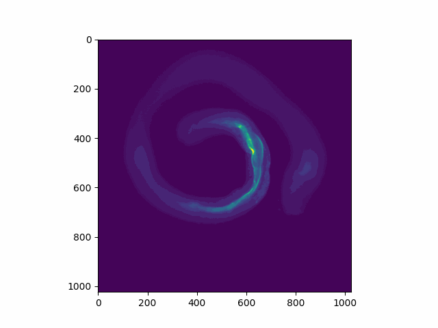

# Computer-Graphics-Final-Project

When analysing the effects of different stimuli on the microscopic roundworm c.elegans, PhD student Divyashree's work at AP lab involves measuring curvature and thickness of its intestine. Her current method of analysing this includes taking an input z-stack and making measurements in 2d from roughly a middle position of the worm.

The issue with this method is that it entirely ignores curvature and thickness in the 3D dimension. Further, given that certain parts of the image are unclear in 2D, it can be difficult to tell if they are part of the intestine or not, meaning useful information may be lost. We can estimate this information from stacks adjacent to the target image. The current method is also fully manual and in this project I aim to autmoate it

For this project, I aim to create a multi stage pipeline to move from an input z-stack to 3d representation of the microscopic worm c elegans from which measurements can be made.

## Limitations

1. I have only one fully labeled image
- My method and any changing must be based on general features of the intestine not on this specific image
- Hence, I tried to visually fine tune my work on unlabelled images, but test on my labeled stack
2. I also only have a labelled trimap (label of 1, 0, and unknown at each point) as it is difficult to get a complete ground truth in 3D
- Hence I

## Input

Labeled stack and corresponding trimap

---

## Stage 1: Estimating Trimap

To estimate the trimap I use a sato filter and apply multi Otsu's Thresholding on this

#### Sato Filter

- Calculates the hessian
- Take the eigen values of the hessian to detect ridge structures
- Along the eigenvectors, there is no change in intensity, while perpendicular to the eigenvectors there is a change in intensity
- I am unclear of the difference between Sato and similar other filters (meijering and the frangi filters), except that Sato works for 3D

#### (Multi) Otsu's Thresholding

- Takes the histogram of grayscale values
- Finds the n biggest clusters
- Based on clusters decides optimal threshold values
- I look for 3 clusters:
	- 0% intestine
	- Unknown
	- 100% intestine

#### Stage 1 Results
Stage 1 RMSE: 28.476046726131596

![[Pasted image 20240510145223.png]]

![[Pasted image 20240510145245.png]]

![[Pasted image 20240510145304.png]]

![[Pasted image 20240510145331.png]]

---

## Stage 2: Label propogation

- Assumption of label propogation: The labels around a point can help us identify the label of the point
- There are many ways of defining locality and finetuning it
- I used a weighted knn algorithm on the point cloud
- (I will get to how I did the transformation to the point cloud later in this presentation)

#### Weighted knn

- Standard skelearn knn algorithm
- distance weight function using gaussian
- minor implementation detail:
incorporate the distance metric into scaling of the pcl, instead of calculating it each time since:
$$e^{-d^{2}/2 (n\sigma)^{2}} = e^{-(d/n)^{2}/2 \sigma^{2}}$$

#### Stage 2 results

After Label propogation, our RMSE reduces and we are getting closer to the true labels:

Stage 1 RMSE: 28.476046726131596

Stage 2 RMSE: 25.12695109038175

![[Pasted image 20240510151758.png]]

![[Pasted image 20240510151811.png]]

![[Pasted image 20240510151828.png]]

![[Pasted image 20240510151839.png]]

## Stage 3: Denoising

In this stage I remove small objects:

- I calculate sizes of each contiguous objects in 3D, and removes all objects below a minimum number of voxels
- Visibility of the intestine in the image is used as a metric to discard bad scans, so we can use this as an absolute metric

#### Stage 3: Unsuccessful (not in final pipeline)

After this denoising stagee, I found we were losing important information. 

Stage 1 RMSE: 28.476046726131596

Stage 2 RMSE: 25.12695109038175

Stage 3 RMSE: 30.780235769535096

While this was part of my original plan, I discarded this step. As we can see RMSE increases, and we can see in the images that this is becuase we lose parts of the intestine which are not connected to the larger body.

![[Pasted image 20240510152410.png]]

![[Pasted image 20240510152818.png]]

![[Pasted image 20240510152832.png]]

![[Pasted image 20240510153159.png]]

## Stage 4: Projection to 3D

- Spinning disk confocal microscope (SDCM):
	- orthographic projection
	- assumption: worm doesn't move while it is being scanned (we assume this because SDCM take fast readings)
- 1 pixel in each dimension is:
  - x: 0.325 μm
  - y: 0.325 μm
  - z: 1 μm

---

#### Further Denoising

- Statistical outlier detection

## Stage 5: Mesh generation

- Alpha Shapes:
	- Based on the convex hull problem for 2D
	- Starts with a larger bounding box
	- Removes spheres of radius alpha without any points, from the larger bounding box until a resulting 'alpha shape is created'. (Think of this like using MS paint and using the eraser tool with radius R)
- The implementation (Open3D) I used is based on work by Edelsbrunner to make a mesh of the Alpha shape
	- It chooses to tetrahedralise the remaining alpha shape
	- Follows assumptions of Delauney triangulation but does not maximise triangle angles 

The point cloud is in world coordinate space (x, y, z, in μm)

We can use the above to do measurements on the image in the 3D space

## Further steps

- benchmarking against a larger dataset or against a true 3D benchmark to measure accuracy
- collapsing the mesh to a single line for measurements of curvature
- segmenting out the worm 'head'
